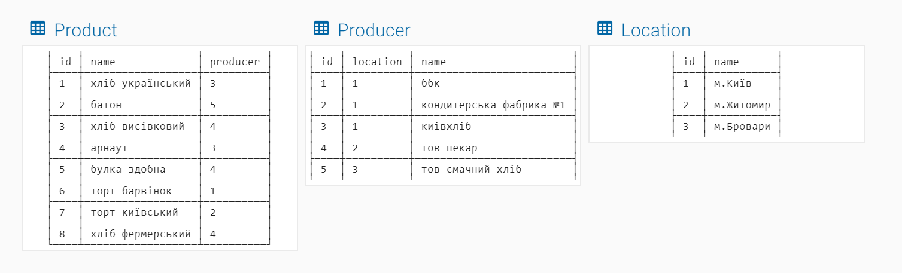
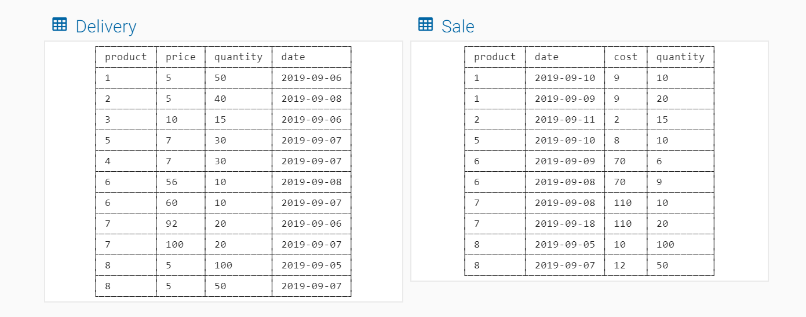
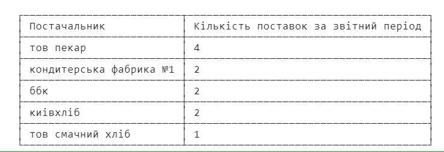
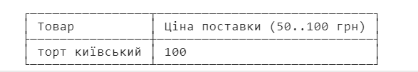
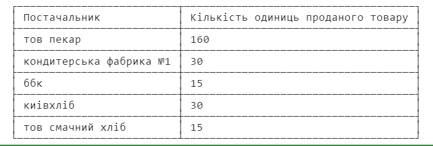

## FUNNY BAKER

### Бази данних

</br>
</br>

### Завдання
1. Отримати звіт про кількість поставок по кожному з постачальників
```sql
SELECT producer.name AS 'Постачальник',
COUNT(producer.name) AS 'Кількість поставок за звітний період'
FROM
producer, product, delivery
WHERE
producer.id = product.producer AND
product.id = delivery.product
GROUP BY producer.name
ORDER BY COUNT(producer.name) DESC;
```
АБО
```sql
SELECT producer.name AS 'Постачальник',
COUNT(producer.name) AS 'Кількість поставок за звітний період'
FROM delivery
INNER JOIN product ON
delivery.product=product.id
INNER JOIN producer ON
product.producer=producer.id
GROUP BY producer.name
ORDER BY COUNT(producer.name) DESC;
```
</br>

2. Отримати звіт по товарам з найвищою ціною поставки в діапазоні 50..100 грн
```sql
SELECT product.name AS 'Товар',
delivery.price AS 'Ціна поставки (50..100 грн)'
FROM delivery, product
WHERE delivery.product = product.id
AND delivery.price BETWEEN 50 AND 100
ORDER BY delivery.price DESC
LIMIT 1;
```
АБО
```sql
SELECT product.name AS 'Товар',
delivery.price AS 'Ціна поставки (50..100 грн)'
FROM delivery
INNER JOIN product ON
product.id = delivery.product
WHERE delivery.price BETWEEN 50 AND 100
ORDER BY delivery.price DESC
LIMIT 1;
```
</br>

3. Отримати звіт по постачальникам та загальній кількості проданих одиниць товару
```sql
SELECT producer.name AS 'Постачальник',
SUM(sale.quantity) AS ' Кількість одиниць проданого товару'
FROM sale, product, producer
WHERE sale.product = product.id
AND product.producer = producer.id
GROUP BY producer.name
ORDER BY COUNT(producer.name) DESC;
```
АБО
```sql
SELECT producer.name AS 'Постачальник',
SUM(sale.quantity) AS 'Кількість одиниць проданого товару'
FROM sale
INNER JOIN product ON
sale.product = product.id
INNER JOIN producer ON
product.producer = producer.id
GROUP BY producer.name
ORDER BY COUNT(producer.name) DESC;
```
</br>
<!--
```sql

```
АБО
```sql

```
</br>
-->
