## FUNNY BAKER

### Бази данних

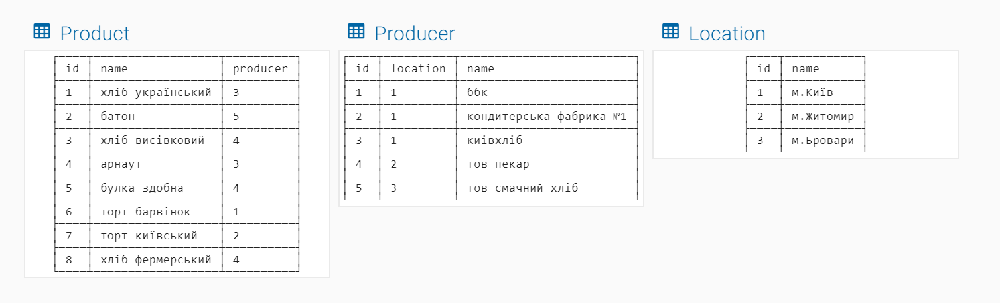</br>
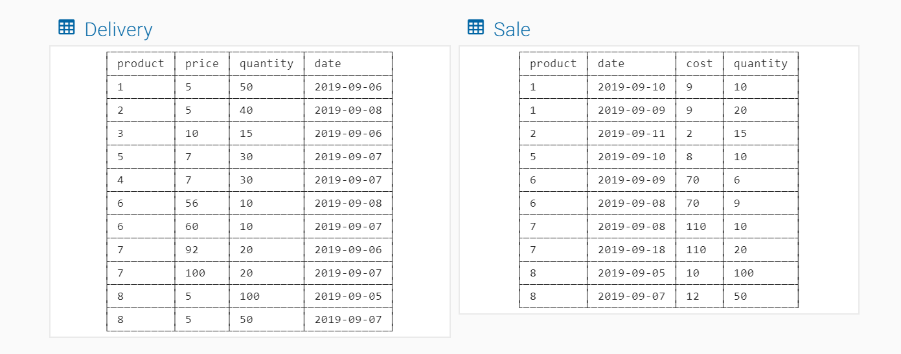</br>

### Завдання
1. Отримати звіт про кількість поставок по кожному з постачальників
```sql
SELECT producer.name AS 'Постачальник',
COUNT(producer.name) AS 'Кількість поставок за звітний період'
FROM
producer, product, delivery
WHERE
producer.id = product.producer AND
product.id = delivery.product
GROUP BY producer.name
ORDER BY COUNT(producer.name) DESC;
```
АБО
```sql
SELECT producer.name AS 'Постачальник',
COUNT(producer.name) AS 'Кількість поставок за звітний період'
FROM delivery
INNER JOIN product ON
delivery.product=product.id
INNER JOIN producer ON
product.producer=producer.id
GROUP BY producer.name
ORDER BY COUNT(producer.name) DESC;
```
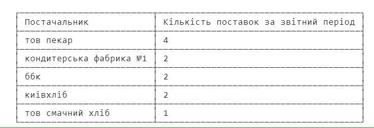</br>

2. Отримати звіт по товарам з найвищою ціною поставки в діапазоні 50..100 грн
```sql
SELECT product.name AS 'Товар',
delivery.price AS 'Ціна поставки (50..100 грн)'
FROM delivery, product
WHERE delivery.product = product.id
AND delivery.price BETWEEN 50 AND 100
ORDER BY delivery.price DESC
LIMIT 1;
```
АБО
```sql
SELECT product.name AS 'Товар',
delivery.price AS 'Ціна поставки (50..100 грн)'
FROM delivery
INNER JOIN product ON
product.id = delivery.product
WHERE delivery.price BETWEEN 50 AND 100
ORDER BY delivery.price DESC
LIMIT 1;
```
</br>

3. Отримати звіт по постачальникам та загальній кількості проданих одиниць товару
```sql
SELECT producer.name AS 'Постачальник',
SUM(sale.quantity) AS ' Кількість одиниць проданого товару'
FROM sale, product, producer
WHERE sale.product = product.id
AND product.producer = producer.id
GROUP BY producer.name
ORDER BY COUNT(producer.name) DESC;
```
АБО
```sql
SELECT producer.name AS 'Постачальник',
SUM(sale.quantity) AS 'Кількість одиниць проданого товару'
FROM sale
INNER JOIN product ON
sale.product = product.id
INNER JOIN producer ON
product.producer = producer.id
GROUP BY producer.name
ORDER BY COUNT(producer.name) DESC;
```
</br>

4. Для постачальника "тов пекар" отримати звіт по поставленим товарам та загальній вартості
```sql
SELECT product.name AS 'Товар (тов пекар)',
SUM(delivery.price * delivery.quantity)
AS 'Загальна вартість (грн)'
FROM product, delivery, producer
WHERE delivery.product = product.id
AND producer.id = product.producer
AND producer.name = 'тов пекар'
GROUP BY product.name
ORDER BY COUNT(product.name) DESC;
```
АБО
```sql
SELECT product.name AS 'Товар (тов пекар)',
SUM(delivery.price * delivery.quantity)
AS 'Загальна вартість (грн)'
FROM delivery
INNER JOIN product ON
delivery.product = product.id
INNER JOIN producer ON
product.producer = producer.id
WHERE producer.name = 'тов пекар'
GROUP BY product.name
ORDER BY COUNT(product.name) DESC;
```
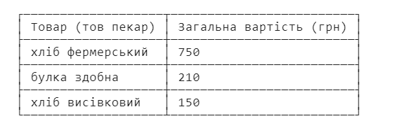</br>

5. Отримати звіт по поставленій кількості тортів
```sql
SELECT product.name AS 'Товар (торти)',
COUNT(delivery.product) AS 'Кількість поставлених одиниць'
FROM delivery, product
WHERE delivery.product = product.id
AND product.name LIKE '%торт%'
GROUP BY product.name
ORDER BY COUNT(product.name) DESC;
```
АБО
```sql
SELECT product.name AS 'Товар (торти)',
COUNT(delivery.product) AS 'Кількість поставлених одиниць'
FROM delivery
INNER JOIN product ON
delivery.product = product.id
AND product.name LIKE '%торт%'
GROUP BY product.name
ORDER BY COUNT(product.name) DESC;
```
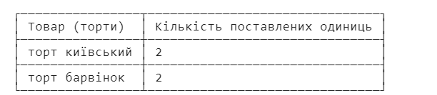</br>

6. Отримати загальну вартість поставок постачальника "тов пекар"
```sql
SELECT SUM(delivery.quantity * delivery.price)
AS 'Загальна вартість поставок "тов пекар"'
FROM delivery,product,producer
WHERE delivery.product = product.id
AND product.producer = producer.id
AND producer.name = 'тов пекар';
```
АБО
```sql
SELECT SUM(delivery.quantity * delivery.price)
AS 'Загальна вартість поставок "тов пекар"'
FROM delivery
INNER JOIN product ON
delivery.product = product.id
INNER JOIN producer ON
product.producer = producer.id
AND producer.name = 'тов пекар';
```
</br>

7. Отримати перелік товарів, поставлених до 07.09.2019
```sql
SELECT product.name AS 'Товар (поставки до 07.09.2019)'
FROM delivery, product
WHERE delivery.product = product.id
AND delivery.date < '2019-09-07';
```
АБО
```sql
SELECT product.name AS 'Товар (поставки до 07.09.2019)'
FROM delivery
INNER JOIN product ON
delivery.product = product.id
WHERE delivery.date < '2019-09-07';
```
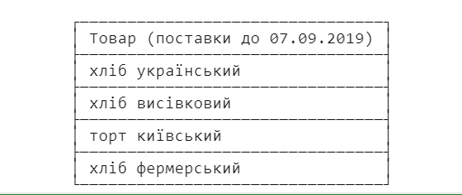</br>

8. Отримати звіт про найвищу ціну продажу для товарів в ціновому діапазоні 10..50 грн
```sql
SELECT product.name AS 'Товар',
MAX(sale.cost) AS 'Найвища ціна продажу (діапазон 10..50 грн)'
FROM product, sale
WHERE sale.product = product.id
AND sale.cost BETWEEN 10 AND 50;
```
АБО
```sql
SELECT product.name AS 'Товар',
MAX(sale.cost) AS 'Найвища ціна продажу (діапазон 10..50 грн)'
FROM sale
INNER JOIN product ON
sale.product = product.id
AND sale.cost BETWEEN 10 AND 50;
```
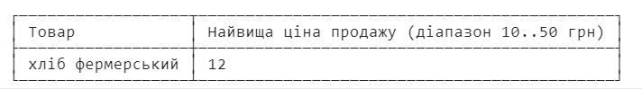</br>

9. Отримати перелік постачалькив, чий товар реалізовувався після 10.09.2020
```sql
SELECT producer.name AS 'Постачальник (реалізований товар після 10.09.2020)'
FROM producer, product, sale
WHERE sale.product = product.id
AND product.producer = producer.id
AND sale.date > '2019-09-10';
```
АБО
```sql
SELECT producer.name AS 'Постачальник (реалізований товар після 10.09.2020)'
FROM sale
INNER JOIN product ON
sale.product = product.id
INNER JOIN producer ON
product.producer = producer.id
WHERE sale.date > '2019-09-10';
```
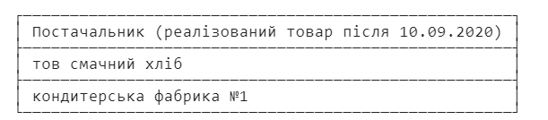</br>

10. Отримати звіт про середню ціну поставки товарів
```sql
SELECT product.name AS 'Товар',
AVG(delivery.price) AS 'Середня ціна поставки'
FROM product, delivery
WHERE delivery.product = product.id
GROUP BY product.name
ORDER BY AVG(delivery.price) DESC;
```
АБО
```sql
SELECT product.name AS 'Товар',
AVG(delivery.price) AS 'Середня ціна поставки'
FROM delivery
INNER JOIN product ON
delivery.product = product.id
GROUP BY product.name
ORDER BY AVG(delivery.price) DESC;
```
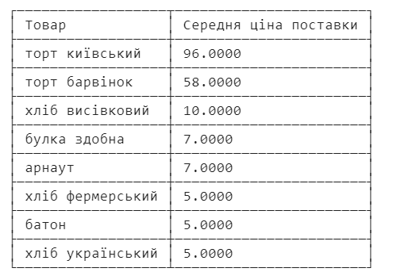</br>

11. Отримати перелік постачальників, чиї товари реалізуються за найвищою ціною
```sql
SELECT p.prod AS 'Постачальник (найвища ціна реалізації товару)'
FROM(
SELECT producer.name AS prod,
SUM(sale.cost)
FROM producer
INNER JOIN product ON
product.producer = producer.id
INNER JOIN sale ON
sale.product = product.id
GROUP BY 1
ORDER BY 2 DESC) AS p
LIMIT 1;
```
</br>

12. Отримати перелік неліквідних товарів (тих, що не продаються)
```sql
SELECT product.name AS 'Неліквідний товар'
FROM product
LEFT JOIN sale ON
sale.product = product.id
LEFT JOIN delivery ON
delivery.product = product.id
WHERE sale.quantity IS NULL
```
</br>

13. Отримати перелік товарів з найнижчою ціною поставки
```sql
SELECT product.name AS 'Товар (найнижча ціна поставки)'
FROM delivery, product
WHERE delivery.product = product.id
ORDER BY delivery.price LIMIT 3
```
АБО
```sql
SELECT product.name AS 'Товар (найнижча ціна поставки)'
FROM delivery
INNER JOIN product ON
delivery.product = product.id
ORDER BY delivery.price LIMIT 3
```
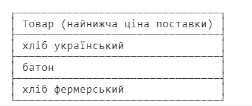</br>

14. Отримати звіт про залишки товарів (різницю між кількістю поставлених та проданих одиниць товарів) за весь звітний період.
```sql
SELECT product.name AS 'Продукт',
SUM(p.quant) AS 'Залишок'
FROM (
    SELECT delivery.product,
    SUM(delivery.quantity) AS quant
    FROM delivery
    GROUP BY delivery.product
    UNION
    SELECT sale.product,
    -SUM(sale.quantity)
    FROM sale
    GROUP BY sale.product
) AS p
INNER JOIN product ON
p.product = product.id
GROUP BY product.name
ORDER BY SUM(p.quant) DESC;
SELECT product.name AS 'Продукт',
SUM(p.quant) AS 'Залишок'
FROM (
    SELECT delivery.product,
    SUM(delivery.quantity) AS quant
    FROM delivery
    GROUP BY delivery.product
    UNION
    SELECT sale.product,
    -SUM(sale.quantity)
    FROM sale
    GROUP BY sale.product
) AS p
INNER JOIN product ON
p.product = product.id
GROUP BY product.name
ORDER BY SUM(p.quant) DESC;

```
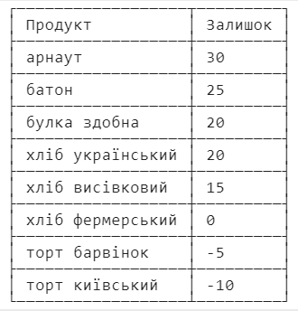</br>

15. Знайти товари, для яких здійснюються необліковані продажі (кількість поставлених товарів менша ніж кількість проданих).
```sql
SELECT ena.name FROM(
    SELECT product.name,
    SUM(p.quant) AS s
    FROM (
        SELECT delivery.product,
        SUM(delivery.quantity) AS quant
        FROM delivery
        GROUP BY delivery.product
        UNION
        SELECT sale.product,
        -SUM(sale.quantity)
        FROM sale
        GROUP BY sale.product
    ) AS p
    INNER JOIN product ON
    p.product = product.id
    GROUP BY product.name
    ORDER BY SUM(p.quant) DESC) AS ena
WHERE s < 0;
```
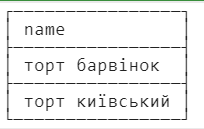</br>

16. Отримати звіт про постачальників товарів та їх розташування
```sql
SELECT producer.name AS 'Постачальник',
location.name AS 'Розташування'
FROM producer, location
WHERE producer.location = location.id;
```
АБО
```sql
SELECT producer.name AS 'Постачальник',
location.name AS 'Розташування'
FROM producer
INNER JOIN location ON
producer.location = location.id;
```
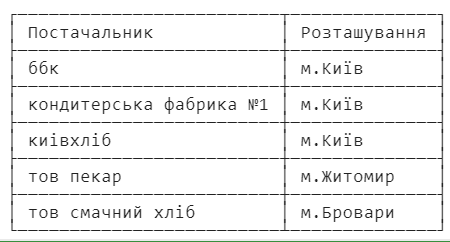</br>

17. Отримати звіт про товари, що приносять найбільший прибуток
```sql
SELECT product.name AS 'Товар (найбільший ймовірний прибуток)',
producer.name AS 'Постачальник'
FROM(
    SELECT prubutok.product,
    SUM(prubutok.costs) AS rizn
    FROM (
        SELECT sale.product,
        MIN(sale.cost) AS costs
        FROM sale
        GROUP BY sale.product
        UNION
        SELECT delivery.product,
        -MAX(delivery.price)
        FROM delivery
        GROUP BY delivery.product
    ) as prubutok
    GROUP BY prubutok.product
    ORDER BY rizn DESC LIMIT 1) AS tr
INNER JOIN product ON
tr.product = product.id
INNER JOIN producer ON
product.producer = producer.id
```
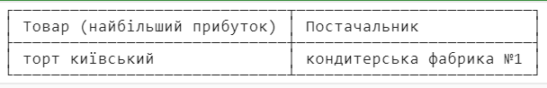</br>

18. Отримати звіт для товарів та загальної суми реалізації >500 грн
```sql
SELECT product.name AS 'Товар',
SUM(sale.cost * sale.quantity) AS 'Загальна сума реалізації (>500)'
FROM product, sale
WHERE sale.product = product.id
GROUP BY product.name
HAVING SUM(sale.cost * sale.quantity) > 500
ORDER BY SUM(sale.cost * sale.quantity) DESC;
```
АБО
```sql
SELECT product.name AS 'Товар',
SUM(sale.cost * sale.quantity) AS 'Загальна сума реалізації (>500)'
FROM sale
INNER JOIN product ON
sale.product = product.id
GROUP BY product.name
HAVING SUM(sale.cost * sale.quantity) > 500
ORDER BY SUM(sale.cost * sale.quantity) DESC;
```
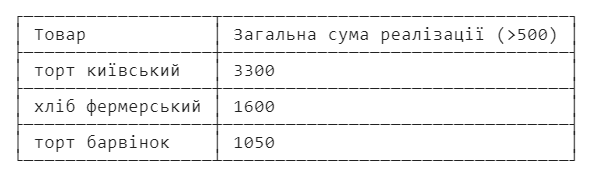</br>

19. Отримати звіт про розташування постачальників
```sql
SELECT location.name AS 'Розташування',
COUNT(producer.name) AS 'Кількість постачальників'
FROM location, producer
WHERE producer.location = location.id
GROUP BY location.name
ORDER BY COUNT(producer.name) DESC;
```
АБО
```sql
SELECT location.name AS 'Розташування',
COUNT(producer.name) AS 'Кількість постачальників'
FROM producer
INNER JOIN location ON
producer.location = location.id
GROUP BY location.name
ORDER BY COUNT(producer.name) DESC;
```
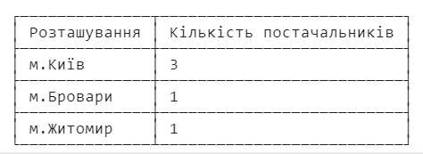</br>

20. Отримати хронологічно впорядкований звіт про витрати та доходи поденно (для тих днів, коли здійснювалися поставки та/або продажі) за весь період
```sql
select ifnull(a.date, 0) as Дата,
ifnull(a.d, 0) as Витрати,
ifnull(b.s, 0) as Дохід
from (select Delivery.date as date,
sum(Delivery.price * Delivery.quantity) as d
from Delivery
group by Delivery.date) as a
left join (select Sale.date,
sum(Sale.cost * Sale.quantity) as s
from Sale
group by Sale.date) as b on a.date = b.date
UNION ALL
select ifnull(b.date, 0) as Дата,
ifnull(a.d, 0) as Витрати,
ifnull(b.s, 0) as Дохід
from (select Delivery.date as date,
sum(Delivery.price * Delivery.quantity) as d
from Delivery
group by Delivery.date) as a
right join (select Sale.date,
sum(Sale.cost * Sale.quantity) as s
from Sale
group by Sale.date) as b on a.date = b.date
```
