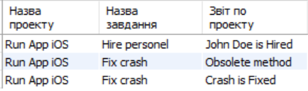
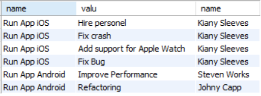

# Відповіді

# Тестові завдання

1. Створити таблицю з замовником і назвою проекту **

```sql
USE our_project;
SELECT project_property.value AS 'Назва замовника',
name AS 'Назва проекту'
FROM project_property,
(SELECT project_property.value AS name,
project_property.Project_id AS ids
 FROM project_property
 WHERE project_property.key = 'Name') AS names
 WHERE names.ids = project_property.Project_id AND
 project_property.key = 'Client';
```


2. Створити таблицю відповідностей імені проекту та його завданнями *

```sql
USE our_project;
SELECT project_property.value AS 'Назва проекту',
	   task_property.value AS 'Назва завдання'
 FROM project
 INNER JOIN project_property ON
 project_property.Project_id = project.id
 INNER JOIN task ON
 task.Project_id = project.id
 INNER JOIN task_property ON
 task_property.Task_id = task.id
 WHERE project_property.key = 'Name' AND
 task_property.key = 'Name';
```


3. Створити таблицю відповідностей імені проекту, імені завдання та звітами по ньому *

```sql
USE our_project;
SELECT project_property.value AS 'Назва проекту',
	   task_property.value AS 'Назва завдання',
       report_property.value AS 'Звіт по проекту'
 FROM project
 INNER JOIN project_property ON
 project_property.Project_id = project.id
 INNER JOIN task ON
 task.Project_id = project.id
 INNER JOIN task_property ON
 task_property.Task_id = task.id
 INNER JOIN report ON
 report.Task_id = task.id
 INNER JOIN report_property ON
 report_property.Report_id = report.id
 WHERE project_property.key = 'Name' AND
 task_property.key = 'Name';
```



4. Створити таблицю відповідностей імені проекту, імені завдання, ролі та працівника які працюють над даним проектом *

```sql
USE our_project;
SELECT project_property.value AS 'Назва проекту',
	   task_property.value AS 'Назва завдання',
       role.name AS 'Роль працівника',
       worker.name AS 'Назва працівника'
 FROM project
 INNER JOIN project_property ON
 project_property.Project_id = project.id
 INNER JOIN task ON
 task.Project_id = project.id
 INNER JOIN task_property ON
 task_property.Task_id = task.id
 INNER JOIN association ON
 association.Task_id = task.id
INNER JOIN worker ON
 association.Worker_id = worker.id
  INNER JOIN role ON
 association.Role_id = role.id
 WHERE project_property.key = 'Name' AND
 task_property.key = 'Name';
```


5. Створити таблицю відповідностей імені проекту, імені завдання, та останный статус завдання **

```sql
USE our_project;
SELECT * FROM
(SELECT project_property.value AS name_proect,
	     task_property.value AS name_task,
		state.description AS last_state
 FROM project
 INNER JOIN project_property ON
 project_property.Project_id = project.id
 INNER JOIN task ON
 task.Project_id = project.id
 INNER JOIN task_property ON
 task_property.Task_id = task.id
 INNER JOIN event ON
 event.Task_id = task.id
  INNER JOIN state ON
 event.State_id = state.id
 WHERE project_property.key = 'Name' AND
 task_property.key = 'Name') as ab
 WHERE name_task =
 (SELECT max(name_task) from ab)

 
```


6. Створити таблицю відповідностей імені імені проекту, імені завдання, останный статус завдання, та ролі працівника **

```sql

```


