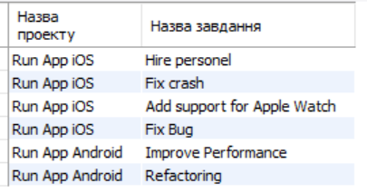
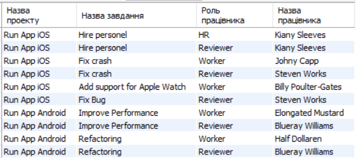
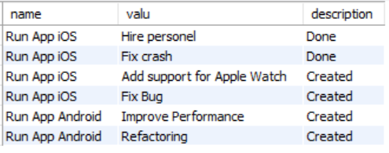

# Відповіді

# Тестові завдання

1. Створити таблицю з замовником і назвою проекту **

```sql
USE our_project;
SELECT project_property.value AS 'Назва замовника',
name AS 'Назва проекту'
FROM project_property,
(SELECT project_property.value AS name,
project_property.Project_id AS ids
 FROM project_property
 WHERE project_property.key = 'Name') AS names
 WHERE names.ids = project_property.Project_id AND
 project_property.key = 'Client';
```


2. Створити таблицю відповідностей імені проекту та його завданнями *

```sql
USE our_project;
SELECT project_property.value AS 'Назва проекту',
	   task_property.value AS 'Назва завдання'
 FROM project
 INNER JOIN project_property ON
 project_property.Project_id = project.id
 INNER JOIN task ON
 task.Project_id = project.id
 INNER JOIN task_property ON
 task_property.Task_id = task.id
 WHERE project_property.key = 'Name' AND
 task_property.key = 'Name';
```



3. Створити таблицю відповідностей імені проекту, імені завдання та звітами по ньому *

```sql
USE our_project;
SELECT project_property.value AS 'Назва проекту',
	   task_property.value AS 'Назва завдання',
       report_property.value AS 'Звіт по проекту'
 FROM project
 INNER JOIN project_property ON
 project_property.Project_id = project.id
 INNER JOIN task ON
 task.Project_id = project.id
 INNER JOIN task_property ON
 task_property.Task_id = task.id
 INNER JOIN report ON
 report.Task_id = task.id
 INNER JOIN report_property ON
 report_property.Report_id = report.id
 WHERE project_property.key = 'Name' AND
 task_property.key = 'Name';
```


4. Створити таблицю відповідностей імені проекту, імені завдання, ролі та працівника які працюють над даним проектом *

```sql
USE our_project;
SELECT project_property.value AS 'Назва проекту',
	   task_property.value AS 'Назва завдання',
       role.name AS 'Роль працівника',
       worker.name AS 'Назва працівника'
 FROM project
 INNER JOIN project_property ON
 project_property.Project_id = project.id
 INNER JOIN task ON
 task.Project_id = project.id
 INNER JOIN task_property ON
 task_property.Task_id = task.id
 INNER JOIN association ON
 association.Task_id = task.id
INNER JOIN worker ON
 association.Worker_id = worker.id
  INNER JOIN role ON
 association.Role_id = role.id
 WHERE project_property.key = 'Name' AND
 task_property.key = 'Name';
```



5. Створити таблицю відповідностей імені проекту, імені завдання, та останный статус завдання **

```sql
select a.name,
b.valu,
state.description
from
(SELECT project_property.value as name,
project_property.Project_id as pr
from project_property
where project_property.key = 'Name'
group by project_property.Project_id) as a
join task on a.pr = task.Project_id
join (select task_property.value as valu,
task_property.Task_id as task
from task_property
where task_property.key = 'Name') as b on b.task = task.id
join (select event.Task_id as task, event.State_id as state
from event
join (select event.Task_id as task,
 max(event.id) as id
from event
group by event.Task_id) as max on max.id = event.id) as state1 on state1.task = task.id
join state on state1.state = state.id
```



6. Створити таблицю відповідностей імені проекту, імені завдання, останный статус завдання, та ролі працівника **

```sql
USE our_project;
select a.name,
b.valu,
work.name
from
(SELECT project_property.value as name,
project_property.Project_id as pr
from project_property
where project_property.key = 'Name'
group by project_property.Project_id) as a
join task on a.pr = task.Project_id
join (select task_property.value as valu,
task_property.Task_id as task
from task_property
where task_property.key = 'Name') as b on b.task = task.id
join (select event.Task_id as task, event.State_id as state, event.id as event
from event
join (select event.Task_id as task,
 max(event.id) as id
from event
group by event.Task_id) as max on max.id = event.id) as state1 on state1.task = task.id
join (select event.id as id, worker.name as name
from event
join worker on event.Worker_id = worker.id) as work on work.id = task.id
```


7. Співставити працівника до його посади у проекті Run App iOS

```sql
USE our_project;
SELECT worker.name AS 'Імя працівника',
role.name AS 'Посада'
FROM association
INNER JOIN worker ON
worker.id = association.Worker_id
INNER JOIN role ON
role.id = association.Role_id
INNER JOIN task ON
task.id = association.Task_id
INNER JOIN project ON
project.id = task.Project_id
INNER JOIN project_property ON
project_property.Project_id = project.id
WHERE project_property.key = 'Name' AND
project_property.value = 'Run App iOS';

```


