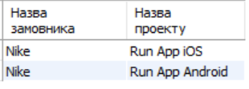
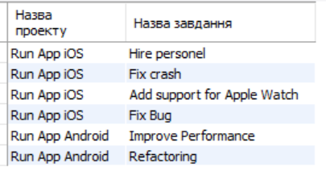
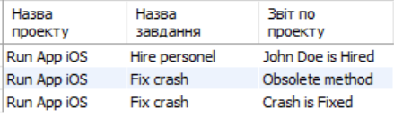
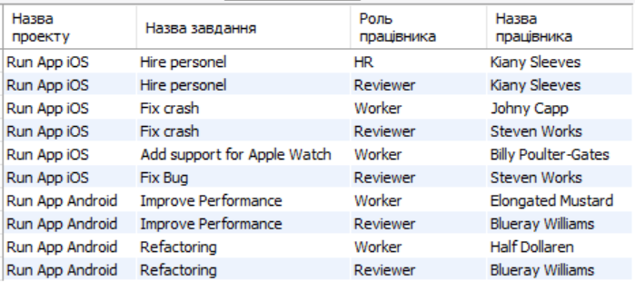
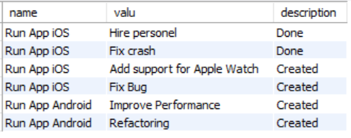
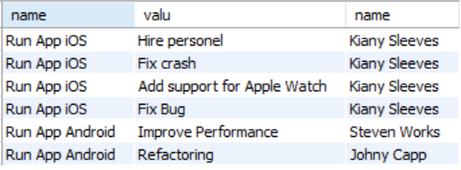

# Тестові завдання

1. Створити таблицю з проектом і назвою проекту **

2. Створити таблицю відповідностей імені проекту та його завданнями *

3. Створити таблицю відповідностей імені проекту, імені завдання та звітами по ньому *

4. Створити таблицю відповідностей імені проекту, імені завдання, ролі та працівника які працюють над даним проектом *

5. Створити таблицю відповідностей імені проекту, імені завдання, та останный статус завдання **

6. Створити таблицю відповідностей імені імені проекту, імені завдання, останный статус завдання, та ролі працівника **

