## Реляційна схема
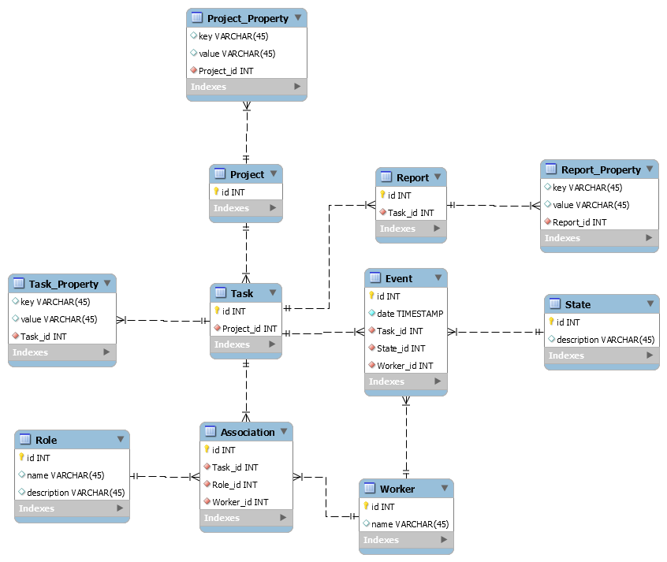

## База даних

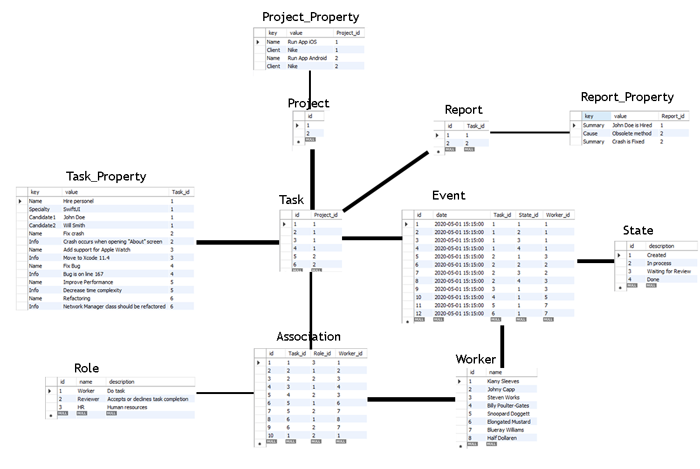

### Progect
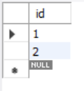

### Project_Property
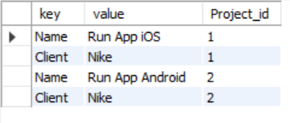

### Task
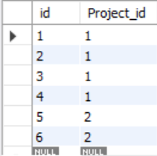

### Task_Property
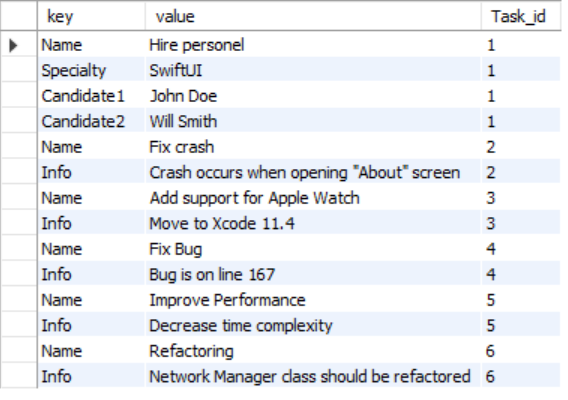

### Report
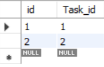

### Report_Property
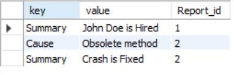

### Event
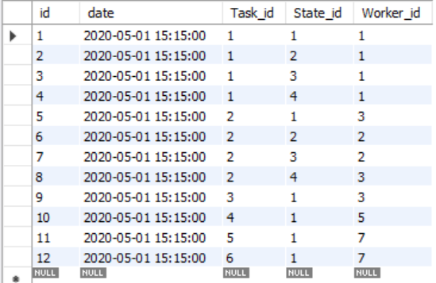

### State
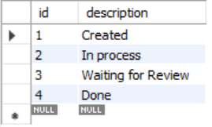

### Association
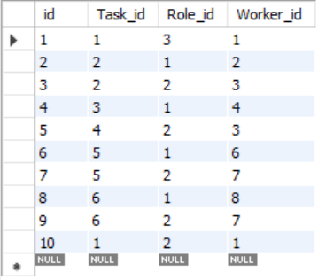

### Worker
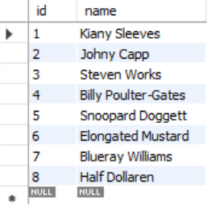

### State

